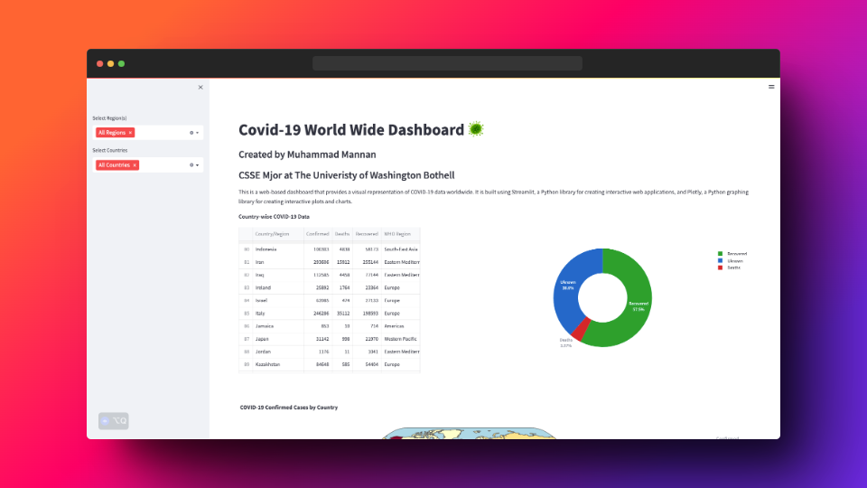
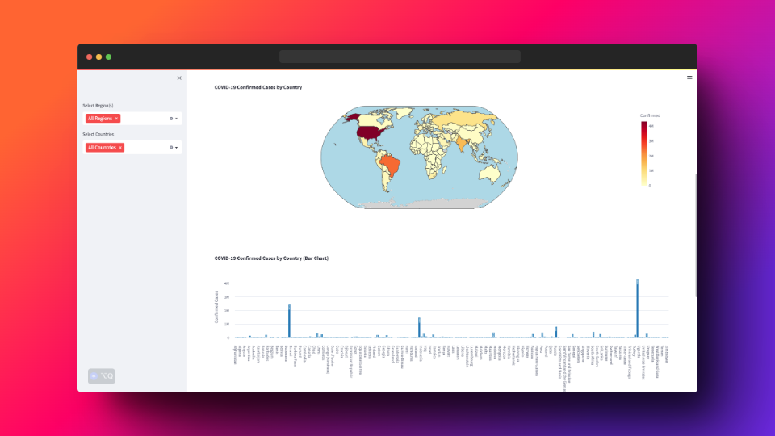
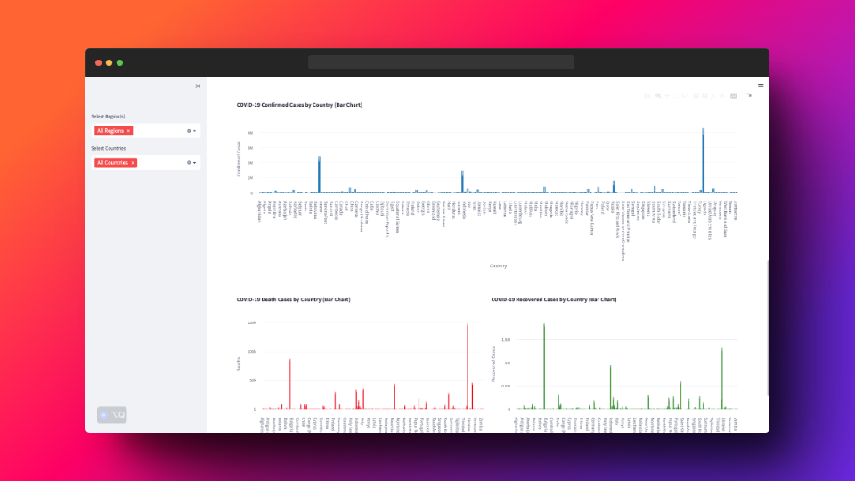

# COVID-19 World Wide Dashboard 🦠

This is a web-based dashboard that provides a visual representation of COVID-19 data worldwide. It is built using Streamlit, a Python library for creating interactive web applications, and Plotly, a Python graphing library for creating interactive plots and charts.

## Features

- Filter data by country and WHO region using the sidebar on the left
- Display country-wise COVID-19 data in a scrollable table
- Show a donut chart with the percentage representation of deaths, recoveries, and unknown cases
- Display a choropleth map with confirmed cases by country
- Show a bar chart with confirmed cases by country
- Display a heatmap with confirmed cases by country

## Screenshots







## Prerequisites

Before running the dashboard, make sure you have the following installed:

- Python 3
- Streamlit
- Pandas
- Plotly
- Matplotlib

You can install the required packages using the following command:

```
pip install streamlit pandas plotly matplotlib
```

## Usage

1. Clone the repository to your local machine.
2. Navigate to the directory where the repository is cloned.
3. Run the following command to start the Streamlit app:

```
streamlit run covid_dashboard.py
```

4. Open your web browser and go to `http://localhost:8501` to access the COVID-19 World Wide Dashboard.

## Data Source

The dashboard uses data from a CSV file named `covid_data.csv` to display COVID-19 statistics. Make sure to replace this file with your own data or update the code to fetch data from an API or other sources.

## License

This project is licensed under the MIT License. See the [LICENSE](LICENSE) file for details.

## Contributing

If you wish to contribute to this project, feel free to submit a pull request or open an issue for any bugs or feature requests.

## Acknowledgments

- Data source: [Johns Hopkins University Center for Systems Science and Engineering (JHU CSSE)](https://github.com/CSSEGISandData/COVID-19)
- Streamlit: https://streamlit.io/
- Plotly: https://plotly.com/
